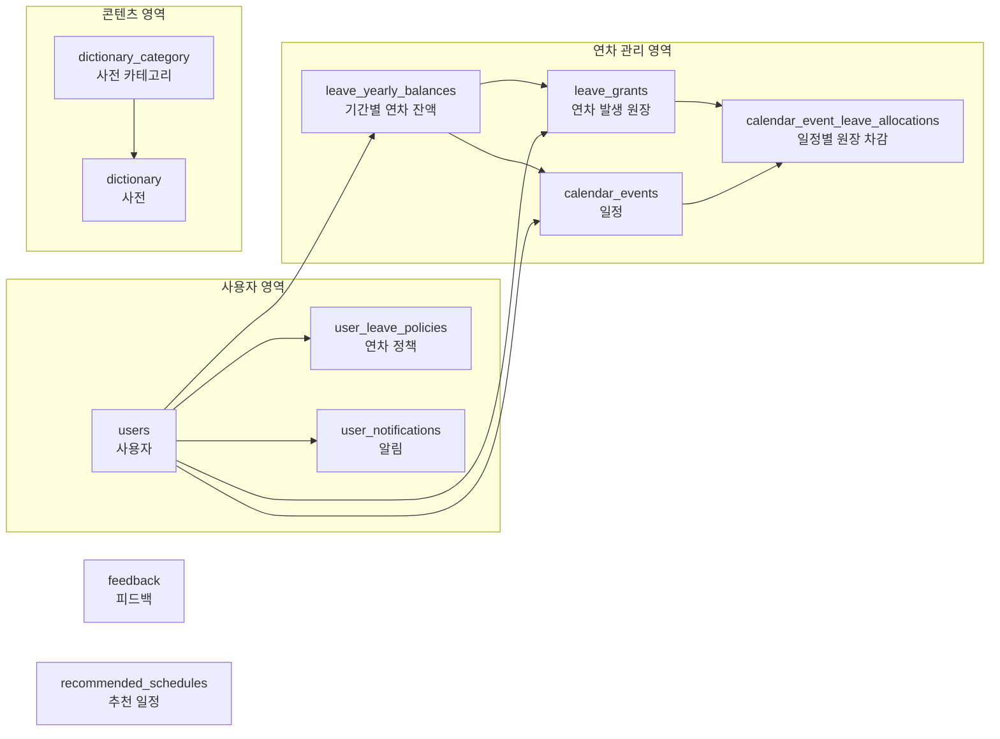
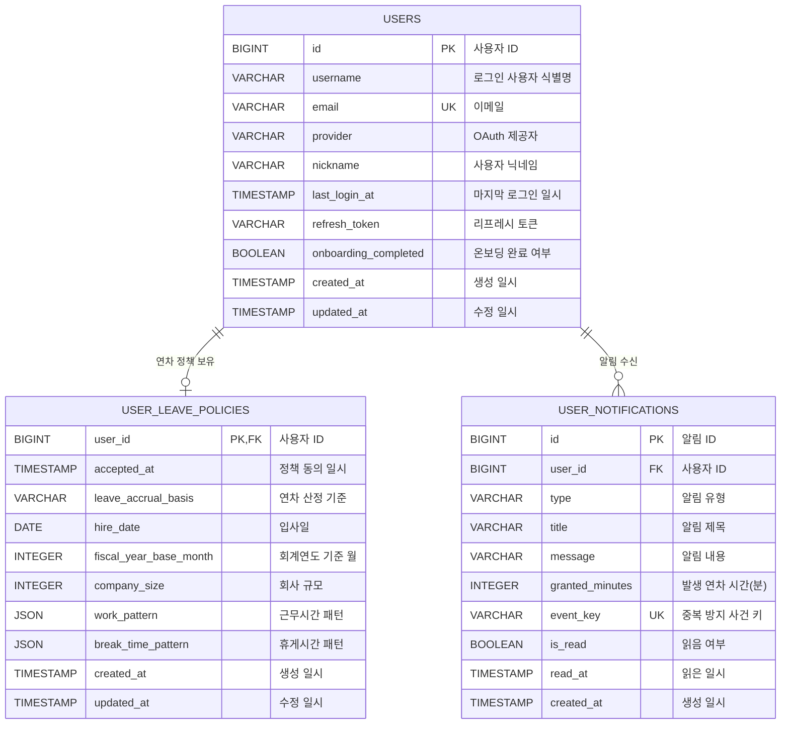
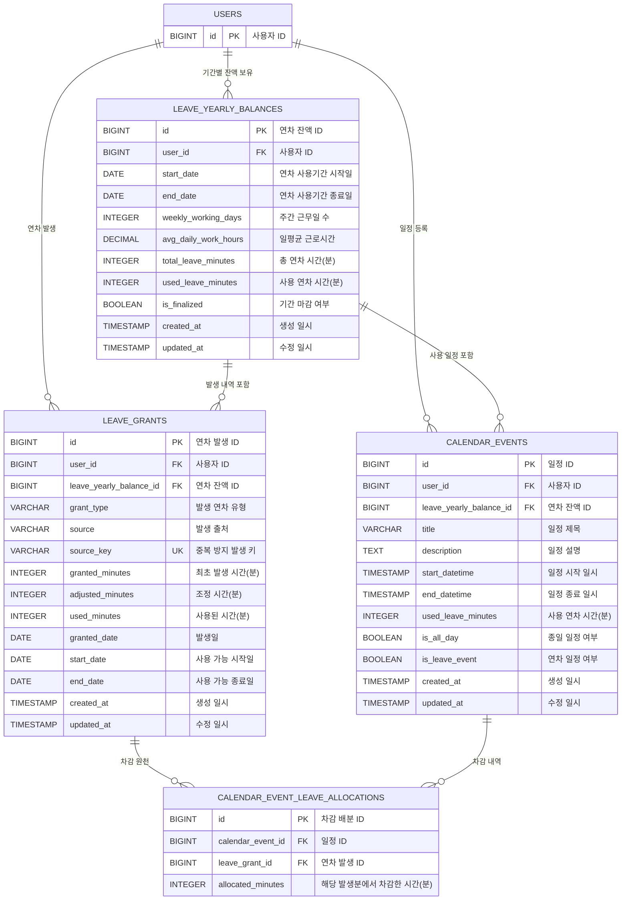
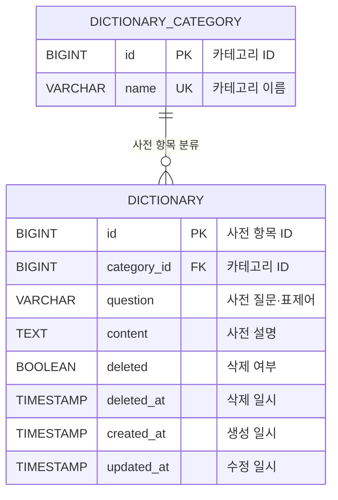
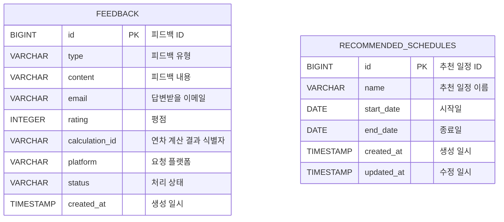

# LawDingBE 현재 데이터베이스 ERD

## 문서 기준

- 기준 스키마: Git에 반영된 Flyway `V1`, Java `V2`, SQL `V3`
- 대상 DB: PostgreSQL
- 테이블 수: 11개
- 연차 수량은 일수가 아니라 모두 **분(minutes)** 단위로 저장됩니다.

## 전체 관계 한눈에 보기



## 1. 사용자·정책·알림 ERD



## 2. 연차 잔액·원장·일정 ERD



## 3. 사전 ERD



## 4. 독립 테이블

피드백과 추천 일정은 다른 PostgreSQL 테이블과 FK 관계가 없습니다.



## 핵심 구조 설명

### 사용자와 연차 정책

- `users`: 회원 계정과 로그인 정보를 저장합니다.
- `user_leave_policies`: 입사일, 연차 산정 기준, 근무 형태를 저장합니다.
- 사용자 한 명당 연차 정책은 최대 한 개입니다.
- `totalLeave`, `usedLeave` 일수는 DB에 저장하지 않고 분으로 환산합니다.

### 연차 잔액과 발생 원장

- `leave_yearly_balances`: 사용 기간별 총 연차와 사용 연차를 분 단위로 저장합니다.
- `leave_grants`: 최초 연차, 월차, 비례 연차, 정기 연차의 발생 내역과 유효기간을 저장합니다.
- 남은 연차는 별도 컬럼이 아니라 다음처럼 계산합니다.

```text
잔액 기준 남은 연차 = total_leave_minutes - used_leave_minutes
원장 기준 남은 연차 = granted_minutes + adjusted_minutes - used_minutes
```

### 일정과 연차 차감

- `calendar_events`: 일반 일정과 연차 일정을 함께 저장합니다.
- `calendar_event_leave_allocations`: 일정이 어느 연차 발생분에서 몇 분 차감됐는지 기록합니다.
- 하나의 일정이 여러 연차 발생 원장에 나뉘어 연결될 수 있습니다.

## 주요 제약조건

| 대상 | 제약조건 |
| --- | --- |
| 사용자 | 이메일은 중복될 수 없음 |
| 연차 잔액 | 사용자와 시작일·종료일 조합은 중복될 수 없음 |
| 연차 발생 원장 | 사용자와 `source_key` 조합은 중복될 수 없음 |
| 연차 발생 원장 | 시작일은 종료일보다 늦을 수 없음 |
| 연차 발생 원장 | 발생·조정·사용량 계산 결과가 음수가 될 수 없음 |
| 일정 차감 | `allocated_minutes`는 0보다 커야 함 |
| 알림 | 사용자와 `event_key` 조합은 중복될 수 없음 |
| 사전 카테고리 | 카테고리 이름은 중복될 수 없음 |
| 추천 일정 | 이름·시작일·종료일이 모두 같은 일정은 중복될 수 없음 |

## PostgreSQL 외 저장소

| DynamoDB 테이블 | 용도 |
| --- | --- |
| `holidays` | 연도별 공휴일 정보 |
| `app_version_policy` | 플랫폼별 현재·최소 앱 버전과 업데이트 정보 |
